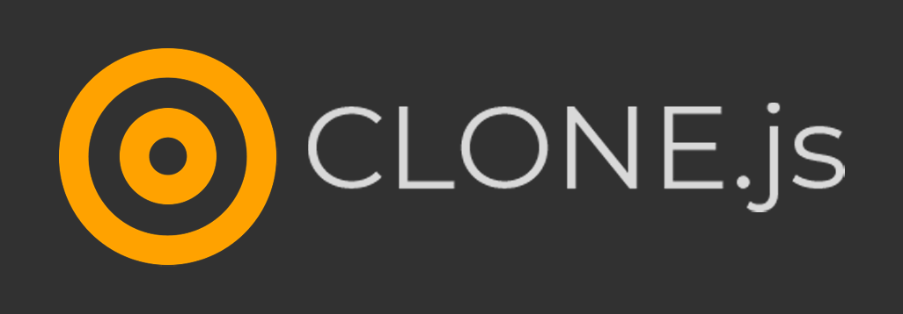

<<<<<<< HEAD

<h1>Clone</h1>

A lightweight javascript framework for component based UI creation.

## Sample

> Publication coming soon

=======
This is a small JS web framework I created majorly to help
me when I was creating a game webapp in vanilla JS.
>>>>>>> 92512c1fe4d5907117c967e303da80ffbcc38324
